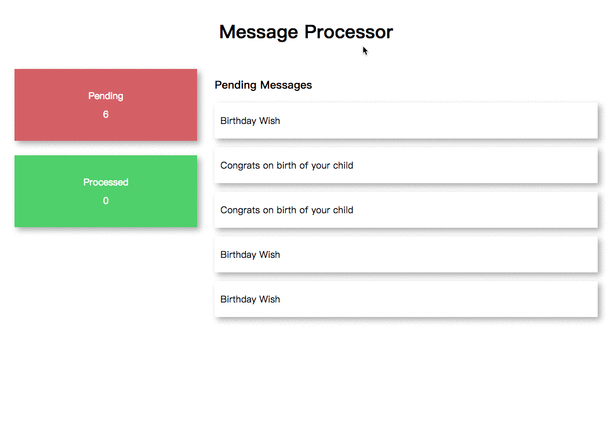

# Demo of Message Processor

This project is a simple demo show case of Angular 2. It is a message processor which only have a very simple dashboard page.

## Requirement
- Node 6.9.0 or later
- Run `npm install` in terminal first

## Development server
Run `npm start` to start a dev server. Then navigate to `http://localhost:4200/` in browser.

## Preview

